# Music symbol shortcodes

Piece and book descriptions, and a piece's own notes, support [Markdown](https://commonmark.org/) (see `frontend/src/components/MarkdownText.tsx`). On top of that, a small set of `:shortcode:` codes — styled after the familiar `:emoji:` convention — insert real music-notation symbols, rendered with [Bravura Text](https://github.com/steinbergmedia/bravura) (Steinberg, SIL OFL 1.1), a self-hosted subset containing only the glyphs listed below.

A code is only recognized if it's one of the ones listed here — anything else (`:shrug:`, `:tada:`, etc.) is left as plain text. A code shown inside a code span or code block (`` `:forte:` ``) is also left as plain text, so it can still be used as a literal example.

| Preview | Shortcode(s) | Description | Codepoint |
|:---:|---|---|---|
| 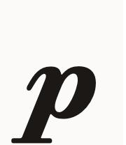 | `:piano:` `:p:` | Dynamic marking — Piano | U+E520 |
| 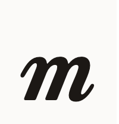 | `:mezzo:` `:m:` | Dynamic marking — Mezzo | U+E521 |
| 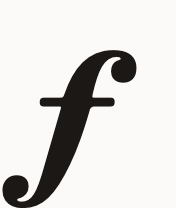 | `:forte:` `:f:` | Dynamic marking — Forte | U+E522 |
| 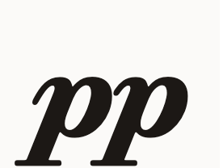 | `:pianissimo:` `:pp:` | Dynamic marking — Pianissimo | U+E52B |
| 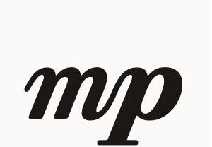 | `:mezzopiano:` `:mp:` | Dynamic marking — Mezzo piano | U+E52C |
| 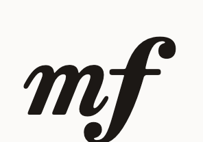 | `:mezzoforte:` `:mf:` | Dynamic marking — Mezzo forte | U+E52D |
| 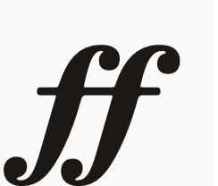 | `:fortissimo:` `:ff:` | Dynamic marking — Fortissimo | U+E52F |
| 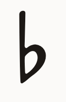 | `:flat:` `:b:` | Accidental — Flat | U+266D |
| 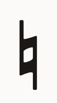 | `:natural:` | Accidental — Natural | U+266E |
| 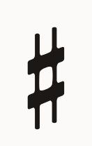 | `:sharp:` `:#:` | Accidental — Sharp | U+266F |
| 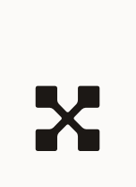 | `:doublesharp:` `:##:` | Accidental — Double sharp | U+ED63 |
| 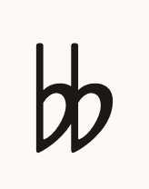 | `:doubleflat:` `:bb:` | Accidental — Double flat | U+ED64 |
| 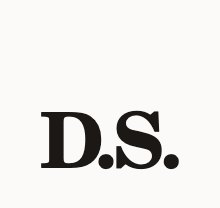 | `:dalsegno:` `:ds:` | D.S. (dal segno) sign | U+E045 |
| 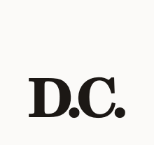 | `:dacapo:` `:dc:` | D.C. (da capo) sign | U+E046 |
| 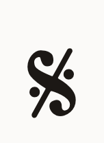 | `:segno:` | Segno sign | U+E047 |
| 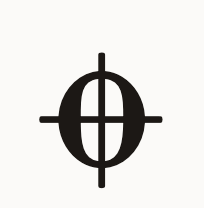 | `:coda:` | Coda sign | U+E048 |
| 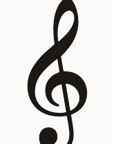 | `:treble:` | Treble clef | U+E050 |
| 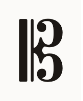 | `:alto:` | Alto clef | U+E05C |
| 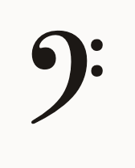 | `:bass:` | Bass clef | U+E062 |
| 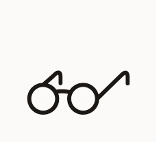 | `:glasses:` `:look:` | Glasses (the most important symbol of all) | U+EC62 |

See `CONTRIBUTING.md`'s "Music symbol shortcodes" section for how this list and its preview images are generated and kept in sync.
